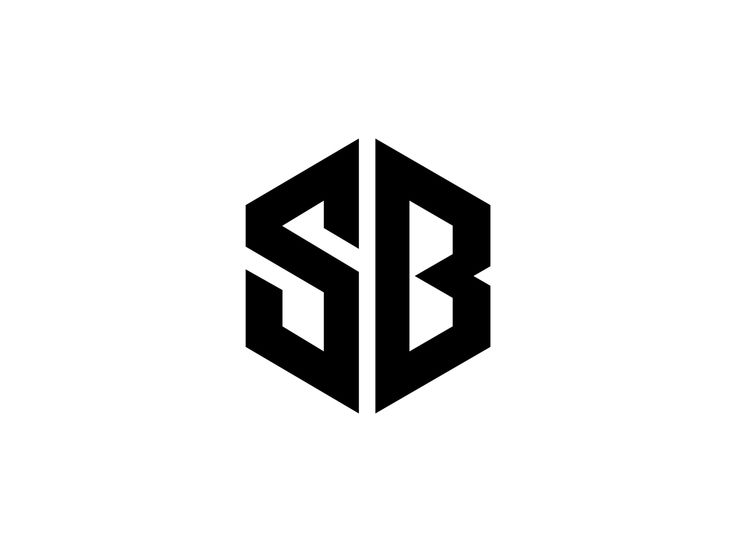

    

# StackBuild

**StackBuild** is a cross-platform application developed in Python using Tkinter. It simplifies the initialization of projects for popular web frameworks such as Next.js, Vue.js, and React Native. This tool provides a user-friendly GUI that allows users to quickly create and set up new projects without the need for command-line interaction.

## Windows Installation

To download StackBuild for Windows, click the link below:

[Download for Windows](https://github.com/avin-madhu/stackbuild/archive/refs/tags/prototype.zip)

### Installation Steps
1. After downloading, open the zip file.
2. Navigate to the `main` directory and extract the program file.
3. Run the `app` executable file.

### Libraries Used
- [Customtkinter](https://github.com/TomSchimansky/CustomTkinter) - A modern and customizable version of Tkinter.

## Version Library

Here are some example versions that can be downloaded:

| Versions           | Size   | Download                       |
| ------------------ | ---    | ------------------------------ |
| StackBuild 1.0     | 40 MB  | [Download](https://github.com/avin-madhu/stackbuild/archive/refs/tags/prototype.zip) |

---
Feel free to contribute
